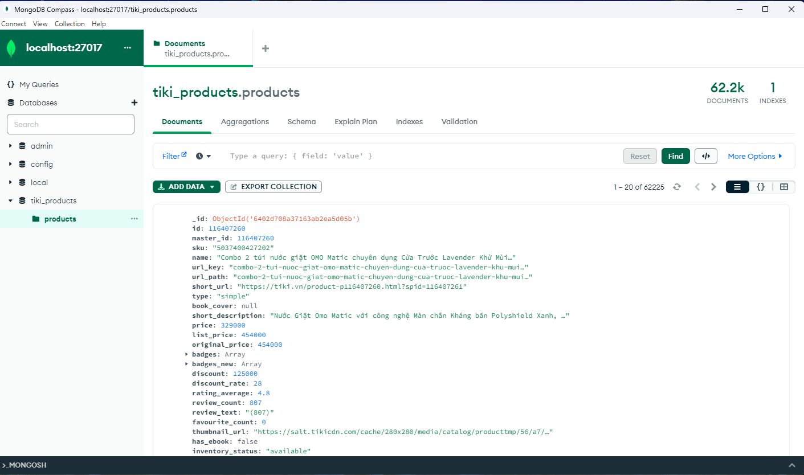
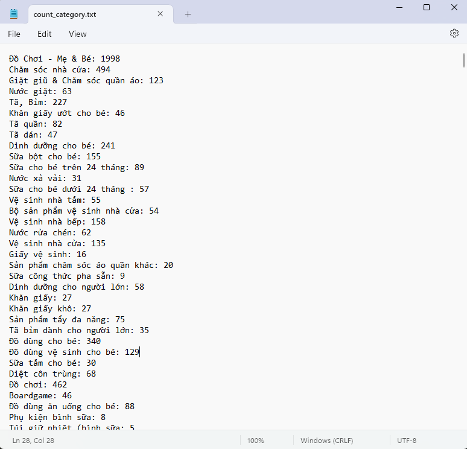
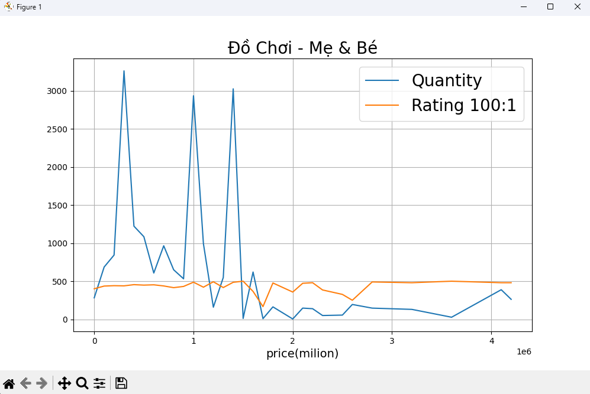

# [Python + MongoDB] Crawl products in Tiki

## Introduction

Bài toán: Lấy toàn bộ sản phẩm trên các danh mục của trang [tiki.vn](https://tiki.vn/) để sử dụng cho nhiều mục đích.

Yêu cầu : 
1. Dữ liệu được crawl về sẽ lưu trong MongoDB
2. Đánh index để hỗ trợ tìm kiếm thông tin trên trường “short_description” được nhanh chóng.
3. Tải toàn bộ ảnh ở “base_url” của mỗi sản phẩm về lưu trong ổ cứng (mỗi sản phẩm có từ 3-5 ảnh)
4. Tạo các biểu đồ cho mỗi danh mục sản phẩm, biểu đồ dạng line, thể hiện độ tương quan giữa giá, rating và số lượng
5. Liệt kê toàn bộ các categories của sản phẩm (từ category cha đến category con), và thống kê mỗi category có bao nhiêu sản phầm

## Demo

   
  <i>All product in MongoDB</i>

   
  <i>Result count product by category</i>

   
  <i>Example of visualize one category</i>

